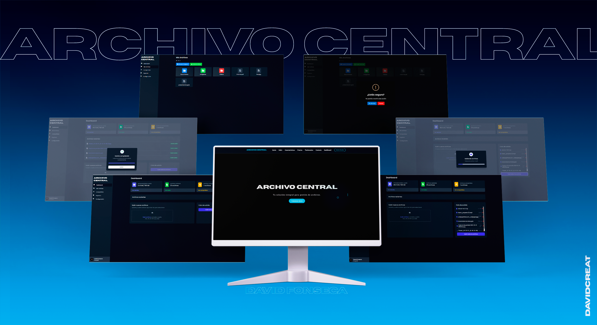

# Archivo Central

## Descripción

**Archivo Central** es un proyecto web diseñado para permitir la subida de archivos de cualquier tipo. Este proyecto se encuentra en su fase de desarrollo del frontend utilizando solo HTML, CSS y JavaScript. Próximamente, será migrado y desplegado en **Angular**.

## Funcionalidades

- Subida de archivos de cualquier tipo (documentos, imágenes, videos, etc.).
- Interfaz intuitiva y amigable.
- Organización de los archivos subidos por categorías.
- Previsualización de archivos (en caso de ser posible).
- Sistema básico de notificaciones para alertar al usuario sobre el estado de la subida.

## Fase actual

El proyecto está en su fase de desarrollo del **Frontend**, implementado con las siguientes tecnologías:
- **HTML5**
- **CSS3**
- **JavaScript (ES6)**

### Próximos pasos

- Migrar el frontend a **Angular**.
- Implementar lógica del backend para el manejo y almacenamiento de los archivos subidos.
- Desplegar el proyecto utilizando Angular y conectar con servicios de almacenamiento.

## Instalación

Este proyecto aún no cuenta con una instalación formal, ya que se encuentra en su fase inicial de desarrollo, utilizando únicamente tecnologías del frontend. No es necesario realizar ninguna instalación.

## Autor

**David Alexander Fonseca Perez**  
Correo: [david.fonseca12p@gmail.com](mailto:david.fonseca12p@gmail.com)  
LinkedIn: [David Alexander Fonseca Perez](https://www.linkedin.com/in/david-fonseca-635a3b2a9/)

## Licencia

Este proyecto está licenciado bajo los términos de la **Licencia MIT**.